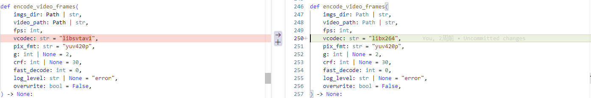
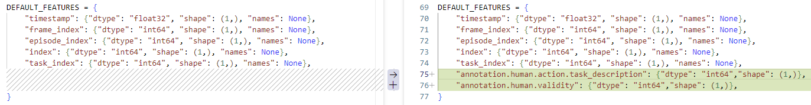
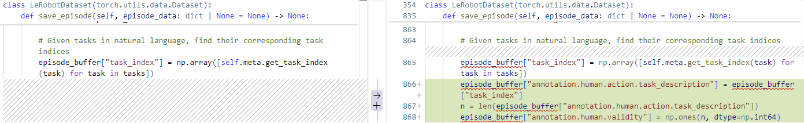
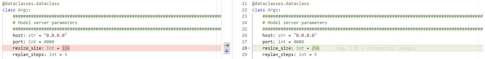
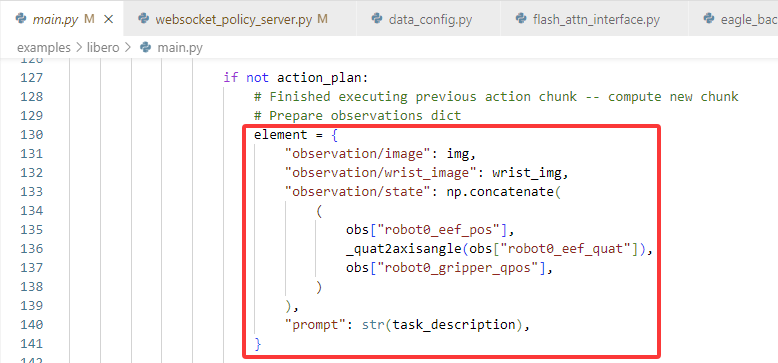
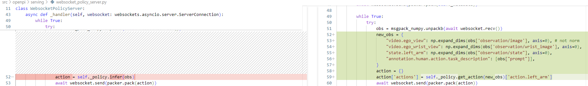
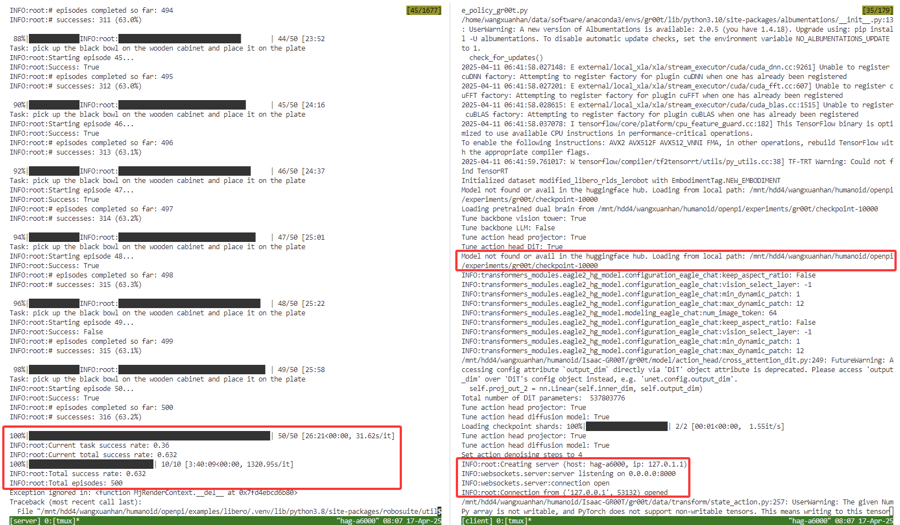

参考[GR00T](https://github.com/NVIDIA/Isaac-GR00T)
# 1. 克隆GR00T仓库并安装GR00T环境
```bash
git clone https://github.com/NVIDIA/Isaac-GR00T
cd Isaac-GR00T

安装官方教程安装python环境
conda create -n gr00t python=3.10
conda activate gr00t
pip install --upgrade setuptools
pip install -e .
pip install --no-build-isolation flash-attn==2.7.1.post4 
```
# 2. 数据集准备
## 2.1 路径
官方给的例子：`demo_data/robot_sim.PickNPlace`  
**如果是自己的数据集，如libero，需要进行转化，以下是转化libero数据集的教程。**  
原始LIBERO数据集下载 https://huggingface.co/datasets/openvla/modified_libero_rlds
转换成lerobot格式：https://github.com/Physical-Intelligence/openpi/blob/main/examples/libero/convert_libero_data_to_lerobot.py
转换成groot格式的的libero数据集：`demo_data/modified_libero_rlds_lerobot`  
转换代码：`convert_libero_data_to_lerobot.py` 
## 2.2 转换环境配置
在GR00T路径下：
``` bash
git clone https://github.com/huggingface/lerobot.git
cd lerobot
pip install -e .
```
## 2.3 需要修改的地方【修改前|修改后】
1. `lerobot/common/datasets/video_utils.py`  
修改video编码格式。  

2. `lerobot/common/datasets/utils.py`  
增加两个默认字段。  

3. `lerobot/common/datasets/lerobot_dataset.py`  

## 2.4 开始转换
```bash
python convert_libero_data_to_lerobot.py \
    --data_dir ./demo_data/modified_libero_rlds_lerobot \
    --output_path <your output path>
```

## 2.5 统计数据集norm stats
由于GR00T没有提供计算norm states的代码，因此我们基于[openpi](https://github.com/Physical-Intelligence/openpi)修改。
### 2.5.1 克隆OPENPI仓库
```bash
conda activate GR00T
git clone https://github.com/Physical-Intelligence/openpi.git
pip install -e . --no-deps
```
### 2.5.2 增加dataconfig
`src/openpi/training/config.py`，在_CONFIGS下增加dataconfig：
```python
TrainConfig(
    name="pi0_libero",
    model=pi0.Pi0Config(),
    data=LeRobotLiberoDataConfig(
        repo_id="my/libero",
        base_config=DataConfig(
            local_files_only=True,  # Set to True for local-only datasets.
            prompt_from_task=True,
            action_sequence_keys=("action", )
        ),
    ),
    weight_loader=weight_loaders.CheckpointWeightLoader("s3://openpi-assets/checkpoints/pi0_base/params"),
    num_train_steps=30_000,
),
```
### 2.5.3 运行
```bash
python compute_norm_stats.py --config-name pi0_libero 
```
将计算的stats.json复制到`demo_data/modified_libero_rlds_lerobot/meta`下。
# 3. 定义数据集config
以libero为例：`gr00t/experiment/data_config.py`  
```python
class LiberoDataConfig(BaseDataConfig):
    video_keys = ["video.ego_view", "video.ego_wrist_view"]
    state_keys = [
        "state.left_arm",
    ]
    action_keys = [
        "action.left_arm",
    ]
    language_keys = ["annotation.human.action.task_description"]
    observation_indices = [0]
    action_indices = list(range(10))

    def modality_config(self) -> dict[str, ModalityConfig]:
        video_modality = ModalityConfig(
            delta_indices=self.observation_indices,
            modality_keys=self.video_keys,
        )

        state_modality = ModalityConfig(
            delta_indices=self.observation_indices,
            modality_keys=self.state_keys,
        )

        action_modality = ModalityConfig(
            delta_indices=self.action_indices,
            modality_keys=self.action_keys,
        )

        language_modality = ModalityConfig(
            delta_indices=self.observation_indices,
            modality_keys=self.language_keys,
        )

        modality_configs = {
            "video": video_modality,
            "state": state_modality,
            "action": action_modality,
            "language": language_modality,
        }

        return modality_configs

    def transform(self) -> ModalityTransform:
        transforms = [
            # video transforms
            VideoToTensor(apply_to=self.video_keys),
            VideoCrop(apply_to=self.video_keys, scale=0.95),
            VideoResize(apply_to=self.video_keys, height=224, width=224, interpolation="linear"),
            VideoColorJitter(
                apply_to=self.video_keys,
                brightness=0.3,
                contrast=0.4,
                saturation=0.5,
                hue=0.08,
            ),
            VideoToNumpy(apply_to=self.video_keys),
            # state transforms
            StateActionToTensor(apply_to=self.state_keys),
            StateActionTransform(
                apply_to=self.state_keys,
                normalization_modes={key: "min_max" for key in self.state_keys},
            ),
            # action transforms
            StateActionToTensor(apply_to=self.action_keys),
            StateActionTransform(
                apply_to=self.action_keys,
                normalization_modes={key: "min_max" for key in self.action_keys},
            ),
            # concat transforms
            ConcatTransform(
                video_concat_order=self.video_keys,
                state_concat_order=self.state_keys,
                action_concat_order=self.action_keys,
            ),
            # model-specific transform
            GR00TTransform(
                state_horizon=len(self.observation_indices),
                action_horizon=len(self.action_indices),
                max_state_dim=64,
                max_action_dim=32,
            ),
        ]
        return ComposedModalityTransform(transforms=transforms)
```
同时在最后的DATA_CONFIG_MAP添加一行：
```python
"libero": LiberoDataConfig()
```
# 4. 微调GR00T
```bash
export CUDA_VISIBLE_DEVICES=0,1,2,3,5,6,7,8
python scripts/gr00t_finetune.py --dataset-path ./demo_data/modified_libero_rlds_lerobot \
    --num-gpus 8 \
    --output_dir "./experiments/gr00t" \
    --save_steps 1000 \
    --data_config libero
```
或者：
```bash
bash finetune.sh
```
# 5. libero上测试成功率
单卡训练10000步的权重路径：`/experiments/gr00t`  
打开openpi仓库：  
## 5.1 终端1
### 5.1.1 安装虚拟环境（已安装好，跳5.1.2）
``` bash
uv venv --python 3.8 examples/libero/.venv
source examples/libero/.venv/bin/activate
uv pip sync examples/libero/requirements.txt third_party/libero/requirements.txt --extra-index-url https://download.pytorch.org/whl/cu113 --index-strategy=unsafe-best-match
uv pip install -e packages/openpi-client
uv pip install -e third_party/libero
export PYTHONPATH=$PYTHONPATH:$PWD/third_party/libero
```
### 5.1.2 激活环境
```bash
source examples/libero/.venv/bin/activate
export PYTHONPATH=$PYTHONPATH:$PWD/third_party/libero
```
### 5.1.3 修改代码
`examples/libero/main.py`  
根据数据集的图像大小修改对应的resize_size：

### 5.1.4 运行libero虚拟环境
```bash
python examples/libero/main.py
```
## 5.2 终端2
`！！！在openpi仓库下不是GR00T仓库下！！！`   
`！！！使用GR00T环境！！！`
### 5.2.1 激活并配置环境
``` bash
conda activate GR00T
pip install -e . --no-deps
pip install -e packages/openpi-client
```
### 5.2.2 修改的代码
虚拟环境给gr00t的是（`examples/libero/main.py`）：

和输入gr00t端的格式不一样，因此进行转化（修改`src/openpi/serving/websocket_policy_server.py`）：

### 5.2.3 运行GR00T推理代码
大概运行3-4小时。
```bash
python scripts/serve_policy_gr00t.py --env LIBERO
```
## 5.3 运行成功示例
左为：GR00T推理 | 右为：libero虚拟环境  
一共十个任务，每个任务50个episode，所以总共500个episode，成功率为63.2%。

>注意：main.py和serve_policy_gr00t.py的端口号要一致，比如都设置为8000。