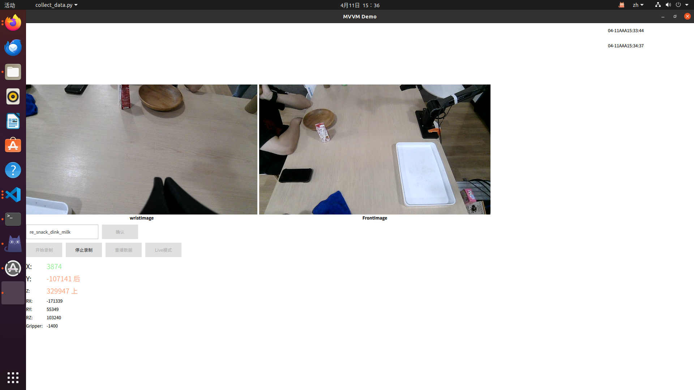

# 数据采集软件

## 硬件需求

* 松灵Piper机械臂 * 2 
* Can口转USB口的转换器
* 杜邦线和面包板（非必需，只是为了方便接线）
* 两台摄像头
* 高性能计算机（至少三个USB口）

## 硬件介绍

### 松灵Piper机械臂

松灵Piper机械臂的简要介绍可以查看[背景说明](./README.md)，这里主要介绍接口信息。

---

机械臂有一条电源线，其与机械臂的连接口被称为**航插**，即航空插口。通过插拔航插，可以为机械臂供电/停电。供电情况下，可以从机械臂的各个缝隙中看到绿色的光，说明是正常供电的。一般会通过插拔电源线与插排的接口来控制是否断电。

> ⚠️ 在不供电的情况下，转动机械臂仍然有可能会看到绿色的光，这是正常的，请不要担心。

电源线上有两条额外延出来的线，一条是黄色，一条是蓝色。这两条都是数据线，用于传递各种控制信号和传输机械臂的状态。后面会多次遇到连线的需求，只需要记住，黄色连黄色，蓝色连蓝色，黄色是H，蓝色是L就行。

---

机械臂在**供电**的情况下有两种状态：**使能**(Enable)/**失能**(Disable)

使能状态表示机械臂通过从数据线传来的信号控制，在这种情况下，是扳不动机械臂的，可以用点力感受一下。

失能状态表示机械臂不接受数据线的信号，这个时候需要通过人工移动机械臂，当然，是有机械助力的。

---

数据收集中使用的两条机械臂可以被分类为Master/Slave或者Leader/Follower，这两种称呼可能会在多个不同的代码中出现，当然，一般来说我们不会这么称呼，而是称其为**主臂**/**从臂**。

主臂和从臂仅是对机械臂内部参数的不同设置，并不是指两条机械臂是不一样的。（但是参数设置也还是挺麻烦的，一般不会动这个设置）

之所以以主从划分机械臂，是因为被设置为主臂的机械臂是用于控制被设置为从臂的机械臂的。

在数据收集时，机械臂的状态从主臂发出，经由数据线传输到从臂，进而控制从臂的状态。而在模型推理阶段，机械臂的状态由模型计算出来，经由数据线传输到从臂，进而控制从臂的状态。

从使能/失能的角度来看，在数据收集时，主臂处于失能状态，从臂处于使能状态，在模型推理阶段，主臂被断电了，从臂处于使能状态。

> ❌ 由于一些未知的原因，请不要在未连接到从臂的状态下为主臂供电。我们在数据采集阶段通过遵循先上从臂电再上主臂电，先断主臂电再断从臂电的方式来规避这个问题。如果出现了失误，请联系谢少解决。

*~~尽管有一些人认为使能和失能的命名很糟糕，但是我认为其实这能够有效提升使用者的普通话水平。~~*

---

机械臂上有一个按钮，是示教模式的开关，这个对于我们的数据采集和模型推理基本上是没有用的。

如果按下处于失能状态的从臂上的示教按钮，从臂会持续记录它的状态，直到该按钮被再次按下。如果有状态信息被记录，连续两次按下示教按钮可以让机械臂重复之前的动作。

### 摄像头介绍

摄像头会持续记录拍摄到的图像，本次使用的摄像头是奥比中光的Dabai dcw，两个都是。能够拍摄RGB图像、深度图像和红外图像，其中RGB和深度图像的帧率为30fps。RGB图像是uint8格式的640\*360\*3，深度图像是uint16格式的640\*360\*1。

### Can口转USB口的转换器

这个主要注意下其实转换器上有刻H和L的就行。

## 数据采集软件介绍

> 软件都保存在/home/pc3/data_collect/songlings下

注意数据采集需要连接主从臂，并且采的数据都是从臂上的数据。

通过以下指令可以快速启动数据收集软件：

```bash
cd /home/pc3/data_collect/songlings
conda activate piper_clt
python data_collect.py
```



使用该软件需要先通过在输入框中输入本次采集的所有数据保存的文件夹，然后点击右边的确定。然后之后采集的数据就会保存在对应的文件夹中的。（这里填的文件夹是相对于data/tmp的路径，一般只用填一个文件夹文字就行。data/tmp这个值可以在代码中进行更改）

然后点击开始录制便可以记录机械臂的运动状态了，点击停止录制便可以停止记录。在右边选择对应的记录并点击重播数据可以重播当时的图像，点击live模式可以回到实时的摄像头图像。

下方有当前机械臂（从臂）的EEF和夹爪状态信息。X、Y和Z后面的数字有颜色，表示当前的机械臂是否处于初始位置，颜色和后面的汉字都符合人类直觉，这里就不赘述了。


### 数据格式介绍

保存的每一条数据包含以下三个方面的内容：
* 从臂状态（包含EEF、Joint和夹爪状态）
	* follower_endpose文件
	* follower_joint文件
	* follower_gripper文件
* 主臂状态（包含Joint和夹爪状态）
	* leader_joint文件
	* leader_gripper文件
* 图像（包含两个摄像头的RGB图像和深度图像）
	* img/front_color文件夹
	* img/front_depth文件夹
	* img/wrist_color文件夹
	* img/wrist_depth文件夹

其中EEF和Joint和夹爪都是序列数据，直接通过二进制存储。具体而言，文件中按顺序直接存储着对应的数据。

其中数据的格式和排列方式为：
```c
struct EEF {
	float64 time_stamp;
	float64 time_stamp;
	int32 X;
	int32 Y;
	int32 Z;
	int32 RX;
	int32 RY;
	int32 RZ;
};

struct Joint {
	float64 time_stamp;
	float64 time_stamp;
	int32 joint1;
	int32 joint2;
	int32 joint3;
	int32 joint4;
	int32 joint5;
	int32 joint6;
};

struct Gripper {
	float64 time_stamp;
	float64 time_stamp;
	int32 grippers_angle;
	int32 grippers_effort;
	int32 status_code;
};
```

数据采集软件使用struct库序列化和反序列化数据，大端存储，相关代码可以在utils.py中查看。


## 注意事项

1. 启动程序时要求先初始化摄像头

令起一个命令行，执行以下命令
```
source ~/deploy/tmp/OrbbecSDK_develop/orbbec_ws/devel/setup.bash
roslaunch orbbec_camera multi_camera.launch
```

如果上述指令执行失败，则先另起一个命令行，执行"roscore"指令

2. 采集过程中机械臂出现了异动

直接暂停数据采集即可，重新启动机械臂并继续采集即可，不需要重新启动软件

3. 采集过程中移动了数据文件

这种过程可能会导致在结束采集时程序出现闪退，重启程序即可，采集了的数据不会丢。

