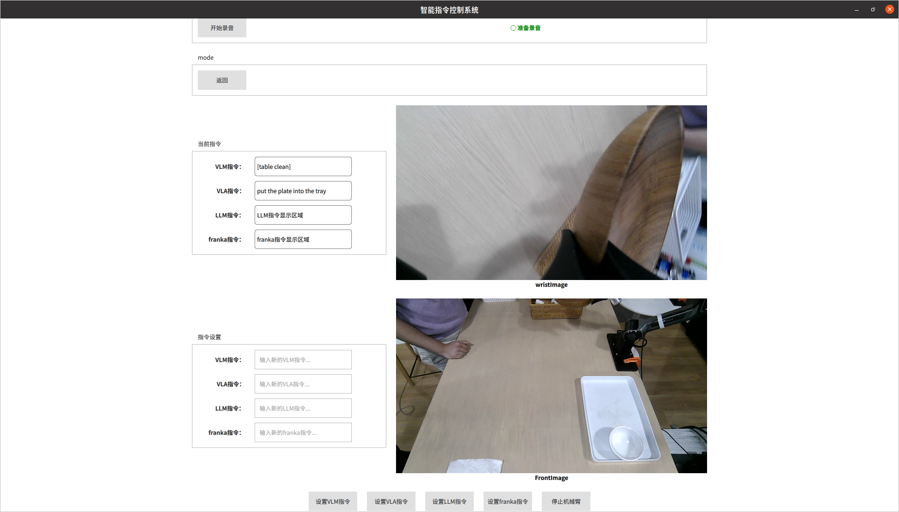

# GUI及系统说明

## GUI启动

***启动GUI控制界面时，请确保至少启动模型LLM,VLM,VLA服务***

- 返回按钮： 点击一次后，屏蔽vla模型action输出开始返回初始位置， 点击第二次后开启vla输出
- 停止按钮: 点击一次后，屏蔽所有的action, 点击第二次开启

- 注意若想单独测试vla, 请不要输入，llm指令和vllm指令， 因为llm指令会影响vllm指令， vllm指令会影响vla指令。若想测试vllm同理不要设置llm指令。
```bash
export CUDA_VISIBLE_DEVICES=2
conda activate deploy
source /home/pc3/deploy/Piper_ros/devel/setup.bash
cd /home/pc3/deploy/gui_4_2
python main.py
```
- 启动后界面如下：




## 系统整体架构：

```tree
gui_4_2/

├── openpi_client #启动openpi端口服务
│   ├── base_policy.py
│   ├── runtime
│   ├── msgpack_numpy.py
│   ├── websocket_client_policy.py
│   ├── image_tools.py
│   ├── __pycache__
│   ├── image_tools_test.py
│   ├── action_chunk_broker.py
│   ├── msgpack_numpy_test.py
│   └── __init__.py
├── lib
│   ├── actor.py #Qthread核心类，避免阻塞
│   ├── prompt.py #LLM prompt
│   ├── image_source.py #更新Qt界面图像
│   ├── llm_inference.py #LLM
│   ├── ros_operator.py #ROS通信封装，消息同步
│   ├── arm_status.py
│   ├── whisper_inference.py #whisper语音转文本
│   ├── __pycache__
│   ├── yolo_detect.py #YOLO检测
│   ├── vllm_inference.py #VLLM
│   ├── task_buffer.py #任务列表，同时用于和franka交互
│   ├── vla_inference.py #VLA
│   └── audio_recorder.py #麦克风录音
├── client.py
├── main.qml #UI界面Qt脚本
├── main.py #主程序
└── flask_send.py #用于模拟franka信息发送
```
